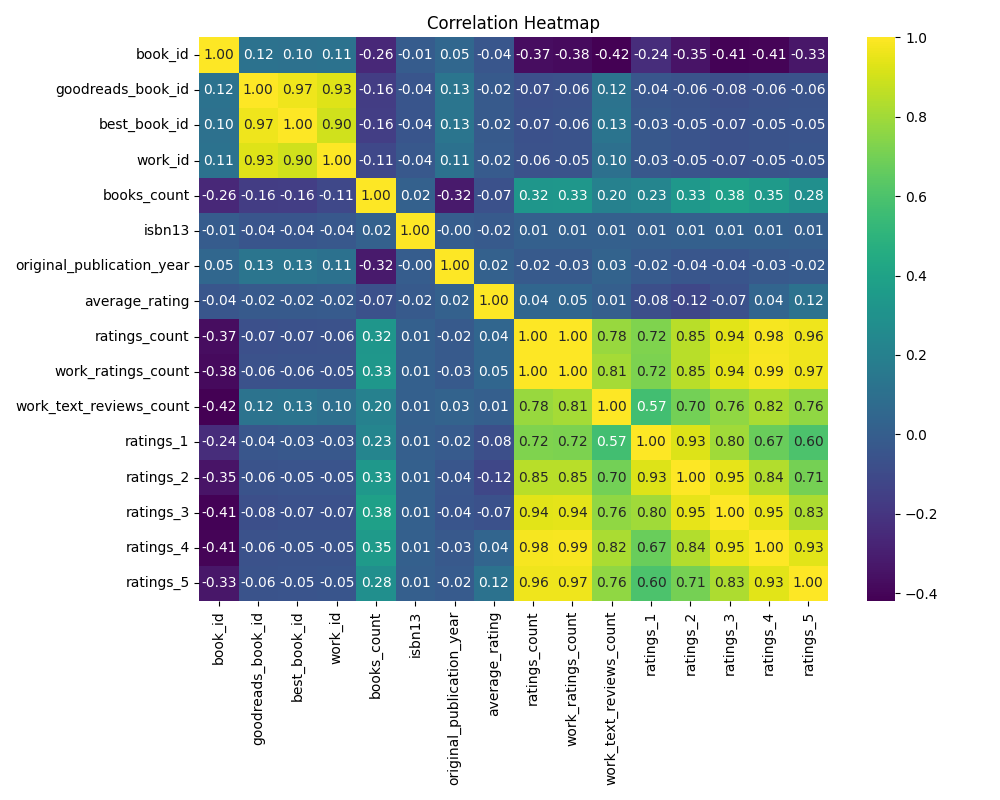

# Analysis Report

### Analysis Report on the Book Dataset

#### **Executive Summary**

This analysis was conducted on a dataset consisting of 10,000 entries of books, detailing various attributes such as ratings, authors, publication years, and more. The analysis reveals trends in ratings distribution, publication years, and factors influencing ratings. Insights gained from the dataset are crucial for authors, publishers, and marketers to understand reader preferences and optimize book offerings.

#### **Dataset Overview**

The dataset consists of comprehensive information on books, including:
- **Identifiers**: `book_id`, `goodreads_book_id`, `best_book_id`, `work_id`
- **Ratings**: `average_rating`, `ratings_count`, `work_ratings_count`, `work_text_reviews_count`, and breakdowns by star ratings
- **Publication Details**: `original_publication_year`, `books_count`
- **Textual Information**: `authors`, `original_title`, `title`, `language_code`, `image_url`, and `small_image_url`

No missing values were detected, ensuring data integrity for analysis.

---

#### **Insights from the Data**

1. **Average Rating Analysis**
   - The mean average rating across the dataset is **4.00**, indicating a generally favorable reception for the books. It’s essential to analyze what factors contribute to this high average.

2. **Ratings Distribution**
   - The distribution of ratings indicates a significant number of **5-star ratings** (19,965) compared to other ratings, with a noticeable tapering off toward lower ratings. This reflects a positive reception but could imply that many books are either loved or have received biased reviews.

3. **Publication Year Insights**
   - The dataset shows that the average publication year is approximately **1982**, with a gradual increase in publication years over time. This trend highlights the potential interest in contemporary literature, necessitating deeper analysis into more recent publications.

4. **Authors and Popularity**
   - “**Stephen King**” is the most frequently listed author, appearing **60 times**. This suggests that his works dominate reader interest, underscoring the importance of popular authors in driving ratings.

5. **Impact of Ratings Count on Ratings**
   - There is a strong positive correlation between ratings counts and average ratings (mean correlation of **0.726**). This suggests more widely read books tend to receive higher ratings, potentially due to visibility and social proof.

6. **Rating Breakdown**
   - Analysis of rating breakdown reveals that **1-star** to **5-star** ratings are positively correlated, indicating that as the count of one rating increases, others tend to do as well. This might suggest that the audience has polarized views but with some cohesive support towards better quality content.

---

#### **Implications**

- **For Authors and Publishers**: Understanding the high levels of ratings can guide the strategies in marketing new releases. The correlation between ratings and visibility illustrates that enhancing an author’s presence significantly influences reader acquisition.
  
- **For Marketers**: With data on the popularity of authors, books can be strategically marketed alongside well-known authors to draw in readership. Utilizing affiliations with these authors could enhance book sales.

- **For Readers**: Insights indicate a majority of readers tend towards positive reviews. For readers looking for reliable recommendations, focusing on books with high visibility and ratings will likely yield high satisfaction.

#### **Recommendations**

1. **Promotional Strategies**: Invest in promoting books with high ratings counts to leverage social proof among readers. Integrating reader reviews and testimonials could bolster buying confidence.

2. **Target Emerging Authors**: Consider marketing campaigns that spotlight lesser-known authors who receive high ratings. Featuring debut authors alongside established ones like Stephen King could diversify reader interests and increase sales for new publications.

3. **Content Marketing**: Create content around trends in reader preferences based on the publication year findings. Content such as blog posts and articles can be focused on 'rediscovering classics' juxtaposed with new offerings.

4. **Reader Engagement Initiatives**: Encourage user-generated content such as reviews and ratings through gamification elements on platforms to cultivate a community of engaged readers.

5. **Data-Driven Decisions**: Publishers should regularly analyze their books using such datasets to continually adjust their marketing tactics based on current trends in ratings and reader demographics.

---

#### **Conclusion**

The analysis of this dataset offers valuable insights into the preferences and behaviors of book readers. By understanding the factors that influence ratings and leveraging them strategically, stakeholders within the literary community can enhance engagement, drive sales, and optimize their offerings for enhanced reader satisfaction.

